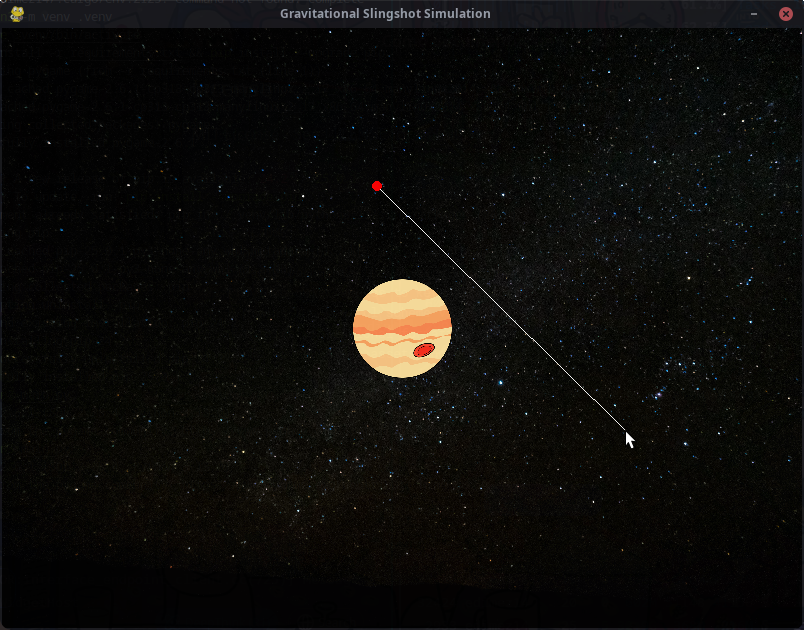
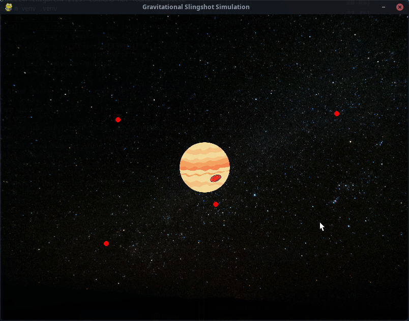

# gravitational_slingshot_simulation
this repository contains a practice realized thanks to the information provided from a youtube video tutorial, from the channel tech with tim, link to the corresponding video https://youtu.be/HTfwhmHVpqM?si=xZAO1KmCN5adMl48



*Visual demonstration of gravitational interactions*

## Features
- Real-time gravitational slingshot effect simulation
- Interactive spacecraft launching with velocity control
- Jupiter-like planetary gravity visualization
- Trajectory prediction line during aiming
- Collision detection with central planet
- Screen boundary management
- Velocity scaling system for precise control
- 60 FPS physics simulation

## Requirements
- Python 3.9+
- Pygame 2.1.3+

## Installation
```bash
git clone https://github.com/edimez14/gravitational_slingshot_simulation
cd gravitational_slingshot_simulation
python3 -m venv .venv
source .venv/bin/activate
pip install -r requirements.txt
```

## Usage

Run the simulation:

```bash
python3 main.py
```

## Controls
| Action               | Command                     |
|----------------------|-----------------------------|
| Aim spacecraft       | Click & drag mouse          |
| Launch spacecraft    | Release mouse button        |
| Reset simulation     | Close and relaunch          |
| Quit                 | ESC or window close button  |

## Physics Implementation
- **Gravitational Force**:  
  ```math
  F = \frac{G \cdot m_1 \cdot m_2}{r^2}
  ```
- **Velocity Calculation**:  
  ```math
  v_{x,y} = \frac{\Delta mouse_{x,y}}{VEL\_SCALE}
  ```
- **Motion Integration**:  
  Euler integration for position updates

## Code Structure
### Key Components:
- **`Planet` Class**  
  - Central gravitational body
  - Handles rendering of planetary texture
  - Mass configuration

- **`Spacecraft` Class**  
  - Implements Newtonian motion physics
  - Handles self-rendering
  - Manages velocity/position updates

- **Core Loop**  
  - Event handling for user input
  - Physics calculations at 60 FPS
  - Collision/edge detection
  - Real-time rendering pipeline

## Asset Credits
- Background: `background.jpg` (Custom space texture)
- Planet Texture: `jupiter.png` (Simple drawing of Jupiter)

## Limitations
- Simplified 2D gravitational model
- Single-body gravity implementation
- No relativistic effects
- Limited to screen boundaries
- Fixed mass values for objects

---

**Developed with**:  
`Python` `Pygame` `Vector Math` `Physics Modeling` `OOP`
